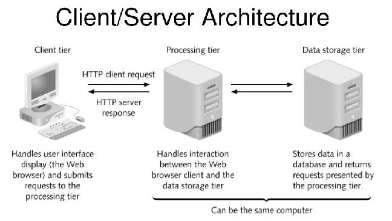
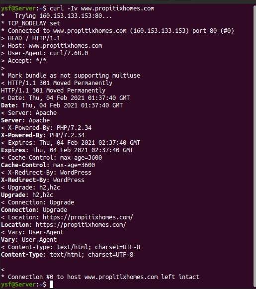
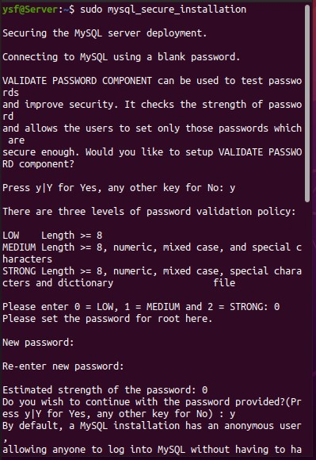
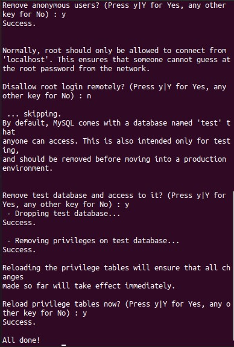
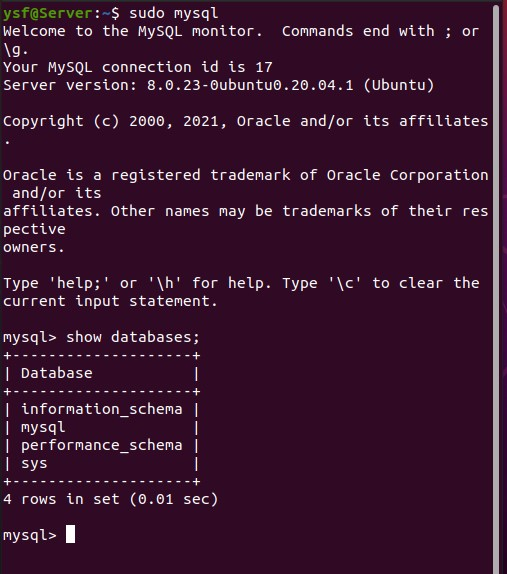
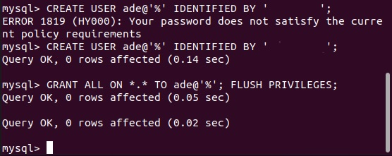
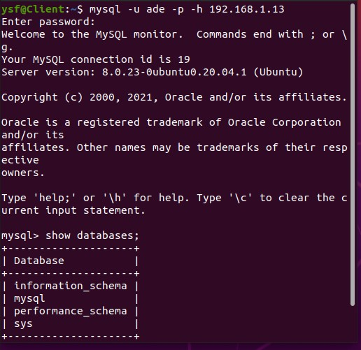

# Understanding Client-Server Architecture Using A MySQL
### At its simplest, the client/server architecture is about dividing up application processing into two or more logically distinct pieces. The database makes up half of the client/server architecture. The database is the “server”; any application that uses that data is a “client.” In many cases, the client and server reside on separate machines; in most cases, the client application is some sort of user-friendly interface to the database.

<p>



### A graphical representation of a simple client/server system.

## Lets take a very quick example and see Client-Server communicatation in action.

* We open up out terminal and install ***curl*** if it doesnt exist.

```
$ sudo apt -y install curl
```

### In this example, the linux terminal will be the client, while ***www.propitixhomes.com*** will be the server

* Send a request from client (Linux Terminal) with the curl command below

```
$ curl -Iv www.propitixhomes.com
```
### We should see the response from the remote server in below output.



## In this project we will be Implementing a Client Server Architecture using a Database Management System (MySQL).

### The instructions below will be followed to complete the project.

* We are going to configure 2 new Linux servers in our Virtualbox
```
Server A - mysql server
Server B - mysql client
```

* On *mysql server* Linux Server, we will install the MySQL software.

```
$ sudo apt -y install mysql-server
```

* We need to configure our *mysql server* installation using this command

```
$ sudo mysql_secure_installation
```

     


* To test that our *mysql server* installation is successful we use this command




* Created a user on the *mysql server* with the following command

```
mysql> CREATE USER ade@'%' IDENTIFIED BY 'your_password';
```

```
mysql> GRANT ALL ON *.* TO ade@'%'; FLUSH PRIVILEGES;
```

### We should see the below output




* On *mysql client* Linux Server, we will install the MySQL client software.

```
$ sudo apt -y install mysql-client
```

* Using the ip addr or ifconfig command, We will figure out the IP address of the mysql server Linux Server.

```
$ ip addr
```
----------------
```
$ ifconfig
```

* On *mysql client* Linux Server, We will connect remotely into the *mysql server* Database Engine using the mysql utility to perform this action.

```
$ mysql -u ade -p -h server_IPaddress
```

* To prove that we have successfully connected we run this command

```
Show databases;
```



# CREDITS
## https://www.oreilly.com/library/view/managing-using/0596002114/ch08s01s01.html#:~:text=At%20its%20simplest%2C%20the%20client,of%20the%20client%2Fserver%20architecture.

## https://professional-pbl.darey.io/en/latest/project5.html?next=https%3A%2F%2Fprofessional-pbl.darey.io%2Fen%2Flatest%2Fproject5.html&ticket=ST-1612399729-pxhBapbi6XHAP8YiliAUmp7Vs5Dhs9kc